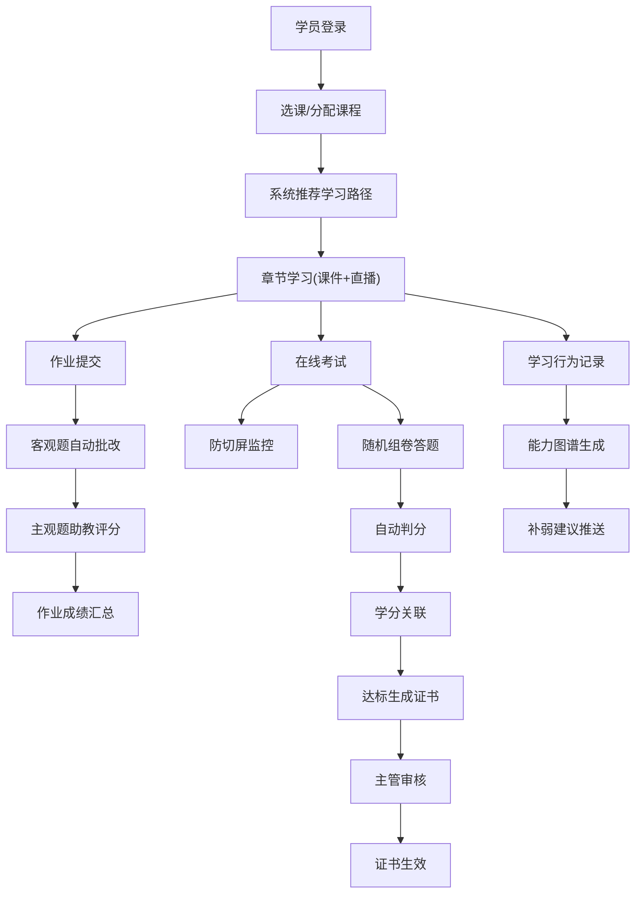

## 1. 产品概述

面向职业教育机构的全流程在线管理平台，覆盖课程创建、直播授课、作业考试、学习分析、师资审核、数据运营等全链路，解决传统职教管理分散、效率低下的痛点。

- 核心价值：构建"教-学-练-测-评-管"闭环，实现教学过程数字化、智能化管理
- 目标用户：职业院校、培训机构、企业内训部门的管理员、教务、讲师、助教及学员

## 2. 核心功能

### 2.1 用户角色与权限

| 角色 | 注册/登录方式 | 核心权限 |
|------|--------------|----------|
| 管理员 | 账号密码登录 | 全局管理、系统配置、所有数据查看、用户权限分配 |
| 教务 | 账号密码登录 | 教学统计数据查看、讲师课程审核、班级管理、证书审核 |
| 讲师 | 申请后审批通过 | 开设课程申请、课程内容管理、直播授课、主观题终审、成绩管理 |
| 助教 | 管理员/讲师分配 | 分配班级学员管理、主观题评分、学员答疑 |
| 学员 | 自主注册/管理员导入 | 课程学习、作业提交、在线考试、证书查看、个人学习数据 |

### 2.2 功能模块

1. **登录/首页大屏**：五级角色登录、实时数据大屏、学科/日期筛选、报表导出
2. **课程管理**：多章节设计、课件上传、试题库管理、智能学习路径推荐
3. **直播中心**：实时互动、弹幕监控与过滤、录屏回放
4. **作业系统**：在线提交、客观题自动批改、主观题助教评分、超时自动升级
5. **考试中心**：随机组卷、防切屏监控、成绩关联学分、电子证书与审核流程
6. **学习分析**：行为全程记录、个人能力图谱、补弱建议推送
7. **师资管理**：讲师开课申请、教务初审、专家评审委员会终审、超期自动驳回
8. **个人中心**：个人信息、学习进度、我的课程/作业/考试/证书

### 2.3 页面详情

| 页面名称 | 模块名称 | 功能描述 |
|----------|----------|----------|
| 登录页 | 登录表单 | 账号密码登录、角色选择、验证码 |
| 数据大屏首页 | 统计概览 | 课程报名人数、完课率、考试通过率、师生比、趋势图 |
| 数据大屏首页 | 筛选导出 | 学科筛选、日期范围筛选、一键导出Excel报表 |
| 课程列表 | 课程卡片 | 课程封面、章节数、报名人数、学习进度、课程状态 |
| 课程详情/编辑 | 章节管理 | 多章节增删改、章节排序、课时设置 |
| 课程详情/编辑 | 课件管理 | 课件上传（PDF/PPT/视频）、预览、下载 |
| 课程详情/编辑 | 试题库 | 题目录入（单选/多选/判断/主观题）、分类管理、批量导入 |
| 课程详情/编辑 | 学习路径 | AI推荐学习路径、前置课程关联、个性化进度调整 |
| 直播教室 | 视频播放区 | 实时视频流、全屏、清晰度切换 |
| 直播教室 | 互动区 | 弹幕发送、在线人数、举手连麦、实时问答 |
| 直播教室 | 弹幕监控 | 敏感词自动过滤、违规警告、黑名单管理 |
| 直播教室 | 录屏回放 | 录制列表、回放播放、倍速、进度记录 |
| 作业列表 | 作业概览 | 作业状态、截止时间、得分统计、提交情况 |
| 作业详情 | 提交批改 | 在线提交、客观题自动判分、主观题分配助教 |
| 作业详情 | 超时处理 | 48小时未批改自动升级讲师、提醒通知 |
| 考试列表 | 考试概览 | 考试安排、时长、状态、成绩查询入口 |
| 在线考试 | 组卷答题 | 随机抽题、选项乱序、倒计时、自动保存 |
| 在线考试 | 防切屏 | 切屏检测、次数警告、强制交卷、摄像头抓拍 |
| 成绩证书 | 成绩学分 | 成绩自动关联学分、证书自动生成、主管审核流程 |
| 学习分析 | 能力图谱 | 雷达图展示各模块能力、历史趋势对比 |
| 学习分析 | 行为记录 | 观看时长、学习轨迹、作业成绩、考试通过率 |
| 学习分析 | 补弱建议 | 薄弱知识点识别、推荐课程/习题推送 |
| 师资管理 | 讲师申请 | 开课申请表单、资质上传、课程大纲提交 |
| 师资管理 | 审核流程 | 教务初审、专家评审终审、审核状态跟踪、超期自动驳回 |
| 个人中心 | 信息管理 | 头像、基本资料、密码修改 |
| 个人中心 | 我的学习 | 学习进度、课程列表、作业/考试记录、证书展示 |

## 3. 核心流程

### 3.1 讲师开课审核流程
讲师提交开课申请 → 教务初审（资料完整性）→ 专家评审委员会终审（课程质量）→ 通过后课程上线；任一环节超期未审核自动驳回。

### 3.2 学员学习全流程
注册登录 → 选课/被分配课程 → 系统推荐学习路径 → 按章节学习（课件+直播）→ 完成作业 → 参加考试 → 获得学分与证书 → 学习分析与补弱建议

### 3.3 作业批改流程
学员提交作业 → 系统自动批改客观题 → 主观题自动分配助教 → 助教48小时内评分 → 超时自动升级讲师处理 → 成绩汇总发布

### 3.4 考试与证书流程
学员进入考试 → 防切屏监控 → 随机组卷答题 → 自动判分 → 成绩关联学分 → 达标自动生成电子证书 → 主管审核 → 证书生效

## 4. 用户界面设计

### 4.1 设计风格
- **主色调**：深海蓝 #0A2463（专业、沉稳）
- **辅助色**：科技青 #3E92CC（数据、智能）、活力橙 #E63946（警示、提醒）、成功绿 #2EC4B6（通过、完成）
- **中性色**：象牙白 #F8F9FA、深灰 #212529、中灰 #6C757D
- **按钮风格**：圆角6px、悬停微亮、点击凹陷、主要操作使用渐变背景
- **字体**：标题使用"思源宋体 SemiBold"（正式感）、正文使用"思源黑体 Regular"（可读性）、数字数据使用"JetBrains Mono"（专业感）
- **布局风格**：左侧导航 + 顶部状态栏 + 右侧内容区的经典后台布局，数据大屏采用卡片网格+可视化图表
- **图标风格**：线性图标，2px描边，圆角端点，与主色一致

### 4.2 页面设计概览

| 页面名称 | 模块名称 | UI要素 |
|----------|----------|--------|
| 登录页 | 登录区 | 深蓝色渐变背景、毛玻璃卡片、品牌Logo居中、表单左对齐、角色切换Tab |
| 数据大屏 | 统计卡 | 大号数字带千分位、趋势小图、上下箭头指示环比、卡片悬浮阴影加深 |
| 数据大屏 | 图表区 | 深色背景配亮色数据曲线、环形图、柱形图、数据标签、hover展示详情 |
| 课程列表 | 课程卡 | 封面图占上半、下半信息三栏（标题/章节数/报名）、进度条渐变 |
| 直播教室 | 主视频 | 16:9黑色背景、控制栏底部悬浮半透明、弹幕从右向左飘过 |
| 直播教室 | 侧边栏 | 聊天区、在线用户列表、弹幕开关、敏感词过滤状态灯 |
| 考试页面 | 答题区 | 题目序号侧边导航、已答/未答/标记状态、顶部倒计时红色闪烁警示 |
| 能力图谱 | 雷达图 | 六边形雷达、渐变填充、多周期对比层叠、各维度得分标注 |
| 审核列表 | 状态流 | 时间轴式审核流程、节点状态色标、超期红色警示、一键处理按钮 |

### 4.3 响应式设计
- **桌面优先**：默认1440px宽度布局，适配1920px及以上大屏
- **平板适配**：左侧导航折叠为图标、表格横向滚动、卡片自适应列数
- **移动端**：顶部汉堡菜单、单列布局、关键数据优先展示、复杂图表简化
- **触控优化**：按钮最小高度44px、列表项点击区域外扩8px、滑动手势支持

### 4.4 动效与交互
- **页面加载**：骨架屏淡入 → 内容依次浮现（staggered 80ms延迟）
- **数据更新**：数字滚动动画（countUp）、图表曲线绘制动画
- **卡片悬停**：向上平移4px + 阴影加深 + 边框微亮
- **状态切换**：标签颜色过渡300ms、进度条填充动画、成功/错误toast滑入
- **大屏特效**：背景网格扫描线、数据点呼吸闪烁、数字翻牌器效果
