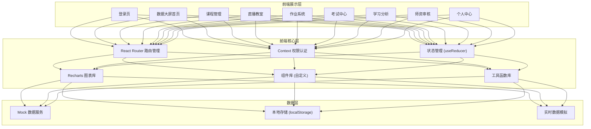
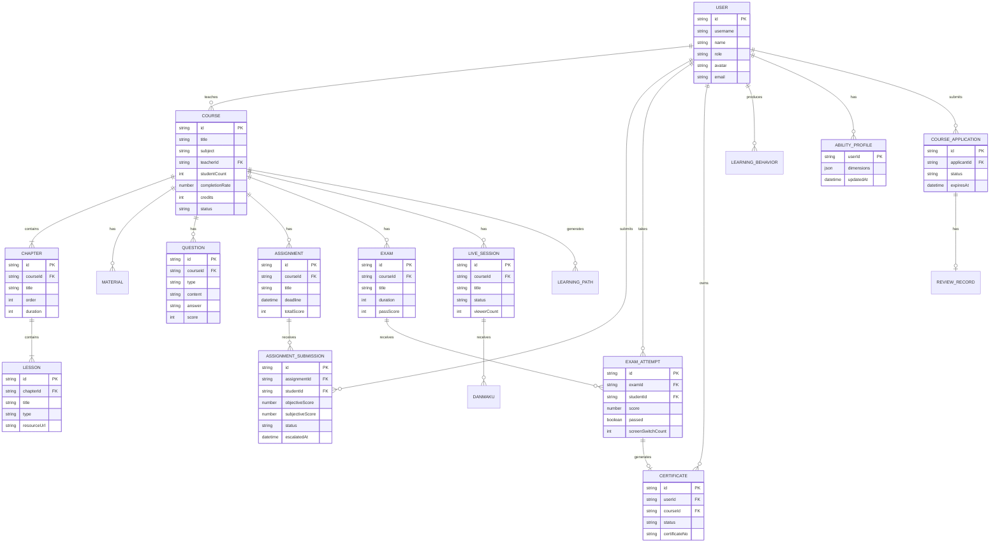

## 1. 架构设计



## 2. 技术描述

- **前端框架**: React@18 + TypeScript
- **构建工具**: Vite@5
- **样式方案**: TailwindCSS@3 + CSS变量主题系统
- **路由管理**: React Router DOM@6
- **图表可视化**: Recharts@2（雷达图、折线图、柱状图、饼图、面积图）
- **图标**: Lucide React
- **状态管理**: React Context + useReducer（轻量级全局状态）
- **数据模拟**: 内置Mock数据，localStorage持久化
- **后端服务**: 无后端（全部使用前端Mock数据模拟完整业务逻辑）

## 3. 路由定义

| 路由路径 | 页面/组件 | 权限角色 | 用途说明 |
|----------|----------|----------|----------|
| `/login` | LoginPage | 公开 | 登录页，支持五级角色登录 |
| `/dashboard` | DashboardPage | 全部 | 数据大屏首页（按角色展示不同内容） |
| `/courses` | CourseListPage | 管理员/教务/讲师/助教/学员 | 课程列表 |
| `/courses/:id` | CourseDetailPage | 管理员/教务/讲师/助教/学员 | 课程详情/编辑 |
| `/courses/:id/chapters` | ChapterManagePage | 管理员/教务/讲师 | 章节管理 |
| `/courses/:id/materials` | MaterialManagePage | 管理员/教务/讲师 | 课件管理 |
| `/courses/:id/questions` | QuestionBankPage | 管理员/教务/讲师 | 试题库管理 |
| `/courses/:id/path` | LearningPathPage | 管理员/教务/讲师/学员 | 学习路径 |
| `/live` | LiveListPage | 管理员/教务/讲师/助教/学员 | 直播列表 |
| `/live/:id` | LiveRoomPage | 管理员/教务/讲师/助教/学员 | 直播教室 |
| `/live/:id/replay` | LiveReplayPage | 学员/助教/讲师 | 录屏回放 |
| `/assignments` | AssignmentListPage | 全部 | 作业列表 |
| `/assignments/:id` | AssignmentDetailPage | 学员（提交）/助教讲师（批改） | 作业详情与批改 |
| `/assignments/:id/submit` | AssignmentSubmitPage | 学员 | 作业提交 |
| `/assignments/:id/grade` | AssignmentGradePage | 助教/讲师 | 作业批改 |
| `/exams` | ExamListPage | 全部 | 考试列表 |
| `/exams/:id/take` | ExamTakePage | 学员 | 在线考试（含防切屏） |
| `/exams/results` | ExamResultPage | 全部 | 成绩与证书 |
| `/certificates` | CertificateListPage | 全部 | 证书列表与审核 |
| `/analytics/:userId` | AnalyticsPage | 学员(自己)/管理员/教务/讲师 | 学习分析与能力图谱 |
| `/teachers` | TeacherAuditPage | 管理员/教务 | 师资管理与审核 |
| `/teachers/apply` | TeacherApplyPage | 讲师 | 讲师开课申请 |
| `/profile` | ProfilePage | 全部 | 个人中心 |
| `/users` | UserManagePage | 管理员 | 用户管理 |

## 4. 核心数据类型定义

```typescript
// 用户角色
export type UserRole = 'admin' | 'dean' | 'teacher' | 'assistant' | 'student';

// 用户
export interface User {
  id: string;
  username: string;
  name: string;
  role: UserRole;
  avatar: string;
  email: string;
  phone?: string;
  department?: string;
  title?: string;
  assignedClasses?: string[]; // 助教分配的班级
  createdAt: string;
}

// 课程
export interface Course {
  id: string;
  title: string;
  description: string;
  cover: string;
  subject: string;
  teacherId: string;
  chapters: Chapter[];
  materials: Material[];
  questions: Question[];
  studentCount: number;
  completionRate: number;
  credits: number;
  prerequisites: string[]; // 前置课程ID
  status: 'draft' | 'pending' | 'approved' | 'rejected' | 'online';
  createdAt: string;
  updatedAt: string;
}

// 章节
export interface Chapter {
  id: string;
  title: string;
  description: string;
  order: number;
  duration: number; // 分钟
  lessons: Lesson[];
}

// 课时
export interface Lesson {
  id: string;
  title: string;
  type: 'video' | 'ppt' | 'pdf' | 'live';
  duration: number;
  resourceUrl: string;
  completed?: boolean;
}

// 课件
export interface Material {
  id: string;
  name: string;
  type: 'pdf' | 'ppt' | 'video' | 'doc' | 'other';
  size: number;
  url: string;
  chapterId?: string;
  uploadedBy: string;
  uploadedAt: string;
}

// 题目类型
export type QuestionType = 'single' | 'multiple' | 'judge' | 'subjective';

// 试题
export interface Question {
  id: string;
  type: QuestionType;
  content: string;
  options?: string[];
  answer: string | string[];
  score: number;
  difficulty: 'easy' | 'medium' | 'hard';
  knowledgePoint: string;
  courseId: string;
  chapterId?: string;
  createdAt: string;
}

// 学习路径
export interface LearningPath {
  id: string;
  userId: string;
  courseId: string;
  steps: PathStep[];
  currentStep: number;
  recommendedAt: string;
}

export interface PathStep {
  id: string;
  chapterId: string;
  lessonId?: string;
  type: 'learn' | 'practice' | 'exam' | 'review';
  estimatedTime: number;
  status: 'pending' | 'in_progress' | 'completed';
}

// 直播
export interface LiveSession {
  id: string;
  courseId: string;
  title: string;
  teacherId: string;
  startTime: string;
  endTime: string;
  status: 'scheduled' | 'live' | 'ended';
  viewerCount: number;
  maxViewerCount: number;
  recordUrl?: string;
  danmakuEnabled: boolean;
}

// 弹幕
export interface Danmaku {
  id: string;
  liveId: string;
  userId: string;
  userName: string;
  content: string;
  timestamp: string;
  isBlocked: boolean;
  blockReason?: string;
}

// 作业
export interface Assignment {
  id: string;
  courseId: string;
  chapterId?: string;
  title: string;
  description: string;
  questions: AssignmentQuestion[];
  deadline: string;
  totalScore: number;
  createdAt: string;
}

export interface AssignmentQuestion {
  questionId: string;
  order: number;
}

// 作业提交
export interface AssignmentSubmission {
  id: string;
  assignmentId: string;
  studentId: string;
  answers: Record<string, string | string[]>;
  submittedAt: string;
  objectiveScore: number;
  subjectiveScore: number;
  totalScore: number;
  gradedBy?: string;
  gradedAt?: string;
  gradingAssignedTo?: string;
  status: 'submitted' | 'grading' | 'graded' | 'escalated';
  escalatedAt?: string;
}

// 考试
export interface Exam {
  id: string;
  courseId: string;
  title: string;
  duration: number; // 分钟
  totalScore: number;
  passScore: number;
  startTime: string;
  endTime: string;
  questionCount: number;
  status: 'draft' | 'published' | 'ongoing' | 'ended';
}

// 考试记录
export interface ExamAttempt {
  id: string;
  examId: string;
  studentId: string;
  questions: Question[]; // 随机抽取的题目
  answers: Record<string, string | string[]>;
  score: number;
  passed: boolean;
  startedAt: string;
  submittedAt?: string;
  screenSwitchCount: number;
  warnings: number;
  forceSubmitted: boolean;
}

// 电子证书
export interface Certificate {
  id: string;
  userId: string;
  courseId: string;
  examId: string;
  score: number;
  credits: number;
  certificateNo: string;
  issuedAt: string;
  status: 'pending' | 'approved' | 'rejected';
  reviewedBy?: string;
  reviewedAt?: string;
  reviewComment?: string;
}

// 学习行为记录
export interface LearningBehavior {
  id: string;
  userId: string;
  courseId: string;
  chapterId?: string;
  lessonId?: string;
  action: 'view' | 'play' | 'pause' | 'complete' | 'download' | 'submit';
  duration: number; // 秒
  timestamp: string;
}

// 能力图谱
export interface AbilityProfile {
  userId: string;
  dimensions: AbilityDimension[];
  updatedAt: string;
}

export interface AbilityDimension {
  name: string;
  score: number; // 0-100
  trend: 'up' | 'down' | 'stable';
  suggestions: string[];
}

// 讲师开课申请
export interface CourseApplication {
  id: string;
  applicantId: string;
  title: string;
  description: string;
  syllabus: string;
  qualifications: string[];
  status: 'pending_dean' | 'pending_expert' | 'approved' | 'rejected';
  submittedAt: string;
  deanReview?: ReviewRecord;
  expertReview?: ReviewRecord;
  expiresAt: string; // 超期自动驳回时间
}

export interface ReviewRecord {
  reviewerId: string;
  reviewerName: string;
  decision: 'approved' | 'rejected';
  comment: string;
  reviewedAt: string;
}

// 数据大屏统计
export interface DashboardStats {
  totalStudents: number;
  totalTeachers: number;
  totalCourses: number;
  totalEnrollments: number;
  completionRate: number;
  examPassRate: number;
  teacherStudentRatio: number;
  subjectBreakdown: { subject: string; count: number }[];
  dailyTrend: { date: string; enrollments: number; completions: number }[];
}
```

## 5. 数据模型 ER 图



## 6. 前端项目结构

```
src/
├── assets/              # 静态资源（图片、字体等）
├── components/          # 通用组件
│   ├── layout/          # 布局组件（Sidebar、Header、Footer）
│   ├── ui/              # UI基础组件（Button、Card、Modal、Table等）
│   └── charts/          # 图表组件
├── contexts/            # React Context（AuthContext、AppContext）
├── data/                # Mock数据
│   ├── mockUsers.ts
│   ├── mockCourses.ts
│   ├── mockAssignments.ts
│   ├── mockExams.ts
│   ├── mockLive.ts
│   └── mockAnalytics.ts
├── hooks/               # 自定义Hooks
│   ├── useAuth.ts
│   ├── usePermissions.ts
│   ├── useCountdown.ts
│   └── useAntiCheat.ts
├── pages/               # 页面组件
│   ├── Login/
│   ├── Dashboard/
│   ├── Courses/
│   ├── Live/
│   ├── Assignments/
│   ├── Exams/
│   ├── Certificates/
│   ├── Analytics/
│   ├── Teachers/
│   ├── Profile/
│   └── Users/
├── router/              # 路由配置
│   └── index.tsx
├── types/               # TypeScript类型定义
│   └── index.ts
├── utils/               # 工具函数
│   ├── auth.ts
│   ├── permission.ts
│   ├── grading.ts       # 自动批改逻辑
│   ├── recommendation.ts # 学习路径推荐算法
│   ├── danmakuFilter.ts # 弹幕过滤
│   ├── export.ts        # 报表导出
│   └── index.ts
├── App.tsx
├── main.tsx
└── index.css
```
